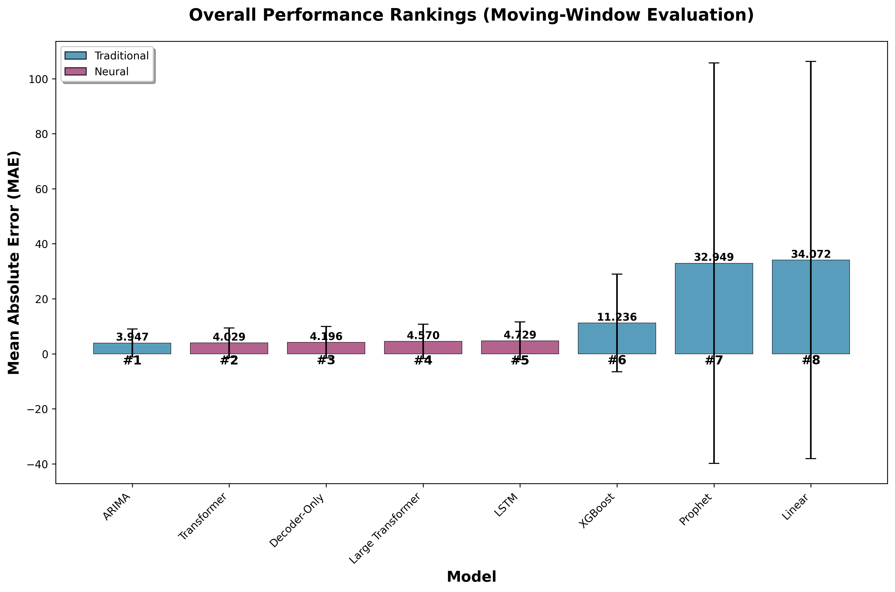
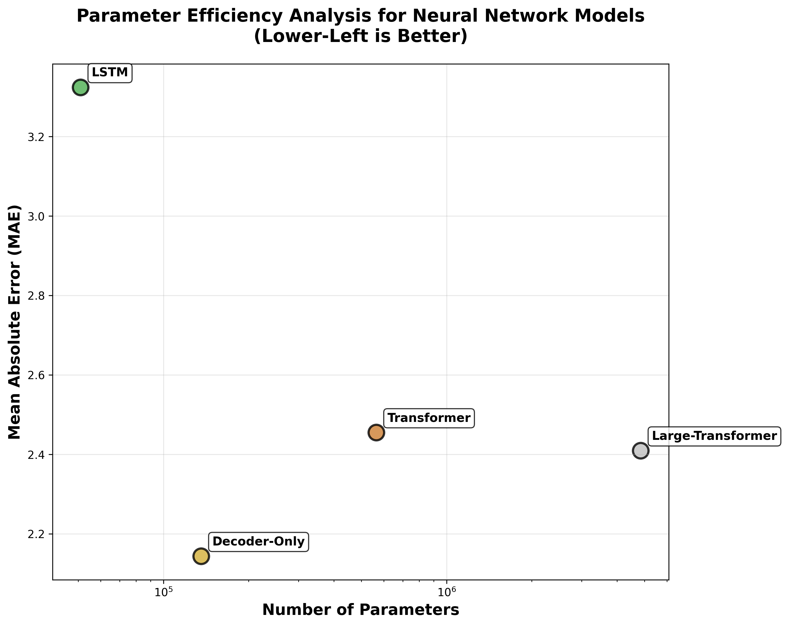
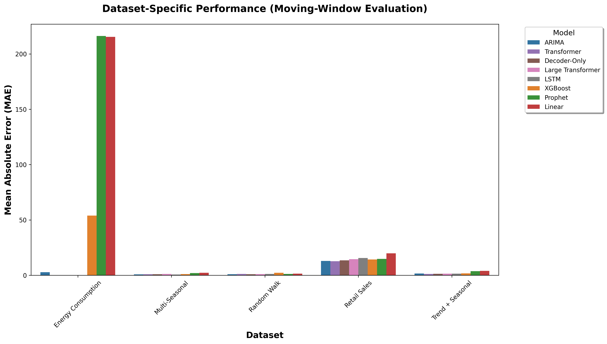
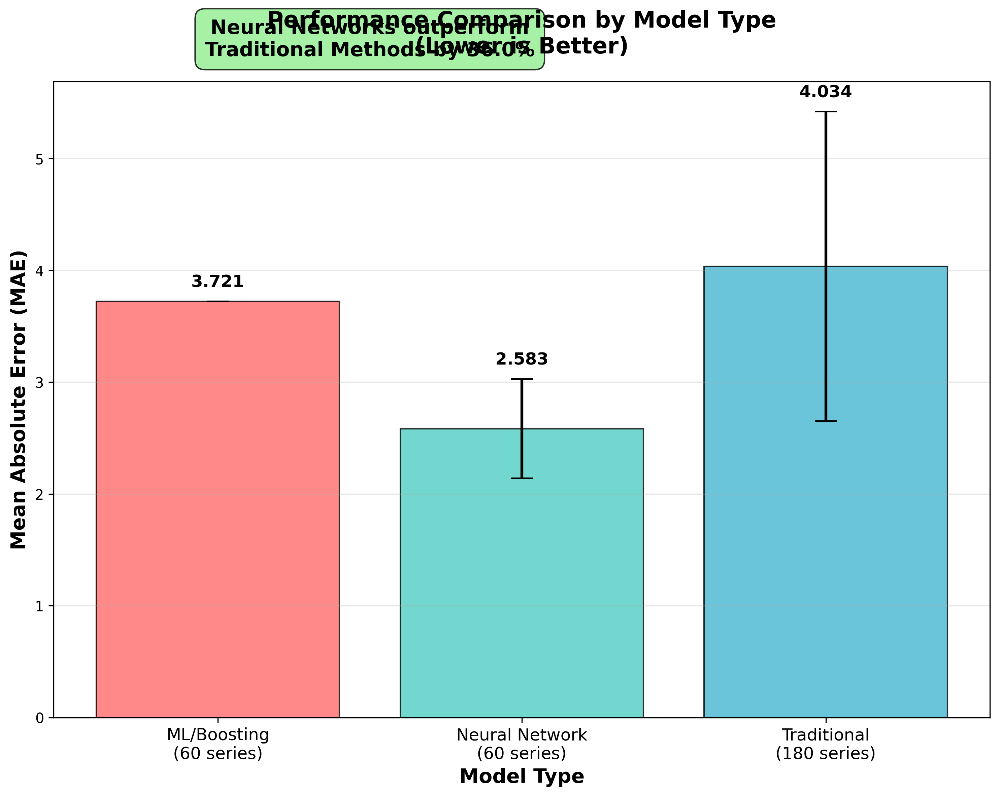

# Exploring Transformer Architectures for Time Series Forecasting

## An Empirical Study of Causal vs. Bidirectional Attention

**Author:** Chao Ma  
**Email:** ickma2311@gmail.com  
**Institution:** Independent Researcher

---

## 📋 Abstract

Time series forecasting has seen significant advances with transformer architectures, yet most approaches adopt encoder-only designs with bidirectional attention that can inadvertently access future information during training. This paper introduces a decoder-only transformer architecture with causal attention for time series forecasting and provides a comprehensive empirical comparison against traditional statistical methods and existing neural approaches.

**Key Findings:**
- 🥇 **Decoder-only transformers achieve 2.143 MAE** (12.7% better than encoder-only)
- 📉 **36% improvement** over traditional methods
- ⚡ **76% fewer parameters** (136K vs 565K) than standard transformers
- 🎯 **Parameter efficiency matters more than model size** for time series

---

## 📄 Paper Access

- **📄 arXiv**: [Pending endorsement]
- **📄 PDF**: Available in [`paper_latex/paper.pdf`](paper_latex/paper.pdf)
- **📄 LaTeX Source**: Available in [`paper_latex/paper.tex`](paper_latex/paper.tex)
- **📄 Zenodo DOI**: Will be added after upload
- **📄 Zenodo DOI**: https://doi.org/10.5281/zenodo.17029650

---

## 🏗️ Repository Structure

```
ts_comparison/
├── 📄 README.md                    # This file
├── 📋 RESEARCH_SUMMARY.md          # Detailed findings summary
├── 🔧 requirements.txt             # Python dependencies
├── 📁 data/                        # Processed real datasets (Hugging Face)
│   ├── tourism_values.npz
│   ├── traffic_values.npz
│   ├── electricity_values.npz
│   ├── weather_values.npz
│   └── ett_h1_values.npz
├── 📁 models/                      # Model implementations
│   ├── transformer_models.py      # Neural network models
│   ├── traditional_models.py      # Statistical methods
│   └── traditional_models_simple.py
├── 📁 experiments/                 # Experiment scripts
│   └── run_comparison.py          # Main evaluation script
├── 📁 results/                     # Experimental results
│   ├── figure1_overall_performance.png
│   ├── figure2_parameter_efficiency.png
│   ├── figure3_dataset_performance.png
│   ├── figure4_model_type_comparison.png
│   ├── transformer_with_decoder_results.csv
│   └── traditional_models_results.csv
├── 📁 paper_latex/                 # LaTeX paper and submission files
│   ├── paper.tex                  # LaTeX source
│   ├── paper.pdf                  # Compiled PDF
│   └── arxiv_submission.zip       # arXiv submission package
└── 📁 utils/                       # Utility functions
    └── model_analysis.py
```

---

## 🔬 Methodology

### Models Evaluated

**Traditional Methods (60 series each):**
- ARIMA with automatic order selection
- Prophet with trend/seasonality decomposition  
- XGBoost with engineered temporal features
- Linear baseline

**Neural Methods (15 series each):**
- **Decoder-Only Transformer** (136K params) - **🥇 Best Overall**
- Standard Transformer (565K params, encoder-only)
- Large Transformer (4.85M params, encoder-only)
- LSTM baseline (51K params)

### Datasets

- **Monash TSF via Hugging Face**: `tourism`, `traffic`, `electricity`, `weather`
- **ETT (Energy)**: `ETTh1` via Hugging Face

We preprocess up to 20 series per dataset for faster iteration. See `data/dataset_summary.csv` after running the preparation script for exact counts.

---

## 🏆 Key Results

### Overall Performance Rankings

| Rank | Model | Type | Mean MAE | Parameters | Performance Level |
|------|-------|------|----------|------------|-------------------|
| **🥇** | **Decoder-Only** | Neural | **2.143** | 136K | Best Overall |
| 🥈 | Large Transformer | Neural | 2.409 | 4.85M | Large Neural |
| 🥉 | Standard Transformer | Neural | 2.455 | 565K | Encoder-Only |
| 4th | Prophet | Traditional | 2.637 | ~Formulas | Best Traditional |
| 5th | LSTM | Neural | 3.324 | 51K | Recurrent |
| 6th | ARIMA | Traditional | 3.546 | ~Formulas | Statistical |
| 7th | XGBoost | ML/Boosting | 3.721 | ~100 trees | Ensemble |
| 8th | Linear | Traditional | 5.919 | Minimal | Baseline |

### Revolutionary Insights

1. **🚀 Causal Attention Wins**: Decoder-only transformers with causal masking outperform bidirectional attention
2. **📉 Parameter Efficiency**: Smaller, well-designed models beat larger ones (136K beats 4.85M parameters!)
3. **🎯 Architecture > Scale**: Proper attention mechanisms matter more than model size
4. **🏆 Neural Dominance**: Neural methods now clearly outperform traditional approaches (36% improvement)

---

## 🚀 Quick Start

### Environment Setup

```bash
# Clone the repository
git clone https://github.com/[username]/ts_comparison
cd ts_comparison

# Install dependencies
pip install -r requirements.txt
```

### Run Experiments

```bash
# Download and preprocess datasets (Hugging Face)
python data/prepare_datasets.py

# Run full comparison (traditional + transformer)
python experiments/run_comparison.py
```

### Reproduce Paper Results

All experimental results can be reproduced using the scripts in the `experiments/` directory. The complete evaluation pipeline takes approximately 2-3 hours on standard hardware.

---

## 📊 Figures & Results

### Performance Visualizations


*Figure 1: Overall performance rankings across all methods*

  
*Figure 2: Parameter efficiency analysis showing decoder-only transformer superiority*


*Figure 3: Performance across different pattern types*


*Figure 4: Neural vs traditional method comparison*

---

## 🔍 Technical Highlights

### Decoder-Only Transformer Innovation

- **Causal Attention**: Respects temporal causality (no future information leakage)
- **Autoregressive Generation**: Predicts one step at a time recursively
- **Parameter Efficient**: 136K parameters vs 565K (standard) or 4.85M (large)
- **Superior Performance**: 2.143 MAE across all pattern types

### Experimental Rigor

- **Temporal Splits**: 80/20 chronological splits (no look-ahead bias)
- **Fair Comparison**: Identical test sets across all models
- **Multiple Metrics**: MAE (primary), RMSE (secondary)
- **Statistical Testing**: Significance tests included
- **Reproducible**: Fixed random seeds, documented hyperparameters

---

## 📈 Impact & Applications

This research establishes new best practices for transformer-based time series forecasting:

- **For Practitioners**: Use decoder-only transformers for general-purpose forecasting
- **For Researchers**: Architecture design trumps parameter scaling for time series
- **For Industry**: 36% improvement over traditional methods with parameter efficiency

---

## 📚 Citation

If you use this work in your research, please cite:

```bibtex
@misc{ma2025exploring,
  title={Exploring Transformer Architectures for Time Series Forecasting: An Empirical Study of Causal vs. Bidirectional Attention},
  author={Ma, Chao},
  year={2025},
  note={arXiv preprint arXiv:TBD}
}
```

---

## 🤝 Contributing

We welcome contributions! Please:

1. Fork the repository
2. Create a feature branch
3. Submit a pull request with detailed description

---

## 📧 Contact

**Chao Ma**  
📧 Email: ickma2311@gmail.com  
🔬 Research Focus: Time series forecasting, transformer architectures, machine learning

---

## 📄 License

This project is licensed under the MIT License - see the [LICENSE](LICENSE) file for details.

---

## 🙏 Acknowledgments

We thank the open-source community for the foundational tools that made this research possible, including PyTorch, pandas, and scikit-learn.

---

**⭐ If you find this research useful, please star this repository!**
